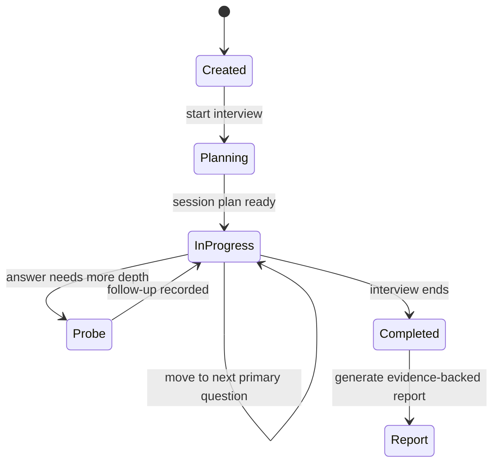

# InterviewPilot

InterviewPilot is a full-stack mock interview platform that simulates realistic technical interviews with AI-assisted planning, adaptive follow-up questions, persistent session state, and structured post-interview reporting.

It is designed as a portfolio-grade project that demonstrates how to combine a modern FastAPI backend, a React frontend, and LLM-based reasoning into a cohesive product experience.

## What this project does

InterviewPilot lets a candidate go through a structured interview flow where:

- a session is created and planned around competency areas
- the interviewer asks primary questions and can probe deeper when answers are weak
- responses are stored as part of a persistent transcript
- the system generates an evidence-backed report at the end of the interview
- the report can be shared for review

This makes the project feel more like a real product than a simple chatbot demo because it preserves state across turns and supports a complete interview lifecycle.

## Key features

- Stateful interview sessions with resumable progress
- AI-powered planning and question adaptation using Groq
- Follow-up question selection based on answer quality
- Text and audio answer support
- Transcript persistence and structured evaluation
- Shareable interview reports
- Deterministic fallbacks so the experience remains usable without an API key
- Docker support for backend containerization

## Tech stack

### Backend
- FastAPI
- SQLAlchemy
- Alembic
- Pydantic / Pydantic Settings
- Uvicorn
- Groq API client

### Frontend
- React
- TypeScript
- Vite
- React Router
- Axios

### Data
- SQLite by default for local development
- PostgreSQL-compatible configuration through environment variables

## Architecture overview



## Getting started

### Prerequisites

- Python 3.11+
- Node.js 22+
- npm or pnpm
- Optional: a Groq API key for AI-powered features

### 1. Clone the repository

```powershell
git clone https://github.com/sadad54/interviewpilot.git
cd interviewpilot
```

### 2. Backend setup

```powershell
cd backend
python -m venv .venv
.\.venv\Scripts\Activate.ps1
python -m pip install -r requirements.txt
```

Create a `.env` file in the backend folder with the following variables:

```env
GROQ_API_KEY=your_groq_api_key
DATABASE_URL=sqlite:///./interviewpilot.db
```

If you do not provide a Groq key, the app will still support text interviews through deterministic fallback logic.

Run the database migrations and seed the local database:

```powershell
alembic upgrade head
python seed.py
```

Start the backend server:

```powershell
uvicorn app.main:app --reload
```

The API will be available at:

- http://localhost:8000/docs
- http://localhost:8000/health

### 3. Frontend setup

```powershell
cd ../frontend
npm ci
npm run dev
```

Open http://localhost:5173 to view the application.

## Docker (optional)

You can also run the backend in a container:

```powershell
cd backend
docker build -t interviewpilot-backend .
docker run -p 8000:8000 --env-file .env interviewpilot-backend
```

## Project structure

```text
backend/
  app/
    core/           # config, database, app wiring
    models/         # SQLAlchemy models
    routers/        # FastAPI endpoints
    schemas/        # request/response schemas
    services/       # interview planning, evaluation, transcription
  alembic/          # database migrations
  tests/           # backend test suite

frontend/
  src/
    components/    # reusable UI components
    pages/         # interview flow pages
    api/           # frontend API client
```

## Why this is a strong portfolio project

InterviewPilot demonstrates several practical engineering skills:

- building a full-stack application end to end
- designing stateful workflows instead of simple one-shot prompts
- integrating external APIs into a production-style backend
- structuring a backend around services, schemas, and persistence
- creating a polished user experience for a complex multi-step interaction


## Verification and demo limitations

The backend suite covers persisted session progress, idempotent answer submission,
bounded follow-ups, completion and shared reports. CI runs backend coverage and
the production frontend build from the repository root. On Linux/macOS:

```bash
cd backend
python -m venv .venv
source .venv/bin/activate
python -m pip install -r requirements-dev.txt
alembic upgrade head
python seed.py
python -m pytest tests/ --cov=app --cov-report=term-missing
uvicorn app.main:app --reload
```

Without a Groq key, text interviews use deterministic demo heuristics. These
length-based scores do not measure technical correctness. Fallback feedback,
turn decisions and final reports now explicitly disclose this, including when
a configured provider fails. Audio transcription requires a working Groq key.
Provider calls in automated tests are mocked; live model quality and live audio
accuracy have not been validated by this readiness pass.

Readiness validation: 19 backend tests passed; statement coverage 654/738 (88.62%, rounded to 89%). Frontend production build passed.
