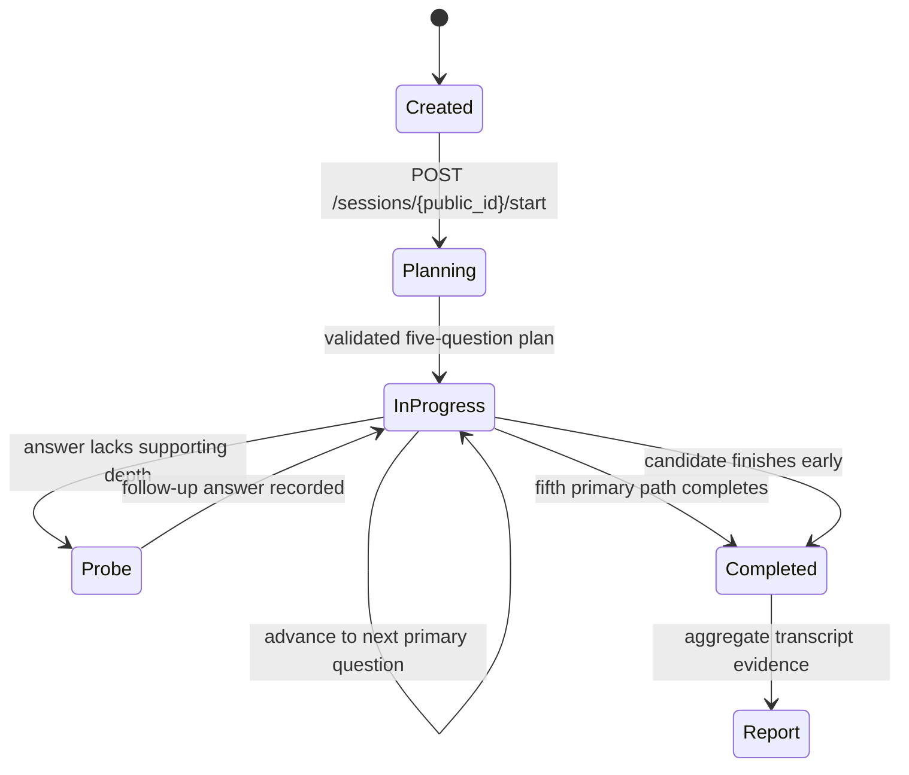

# InterviewPilot

InterviewPilot is a bounded, stateful AI interviewer for realistic technical mock interviews. It plans a competency-balanced session, adapts with targeted probes, persists the complete transcript, and produces an evidence-backed report only after the interview ends.

## Agentic architecture



The workflow deliberately separates responsibilities:

1. **Interview planner** grounds five competency slots in a curated bank, then adapts them to role, seniority, and an optional job description.
2. **Interviewer policy** observes each answer and chooses one bounded action: probe, advance, or complete. Each primary question can produce at most one follow-up.
3. **Turn evaluator** stores private structured scores and safe decision summaries. Mid-interview coaching remains hidden.
4. **Report generator** aggregates competency scores and cites persisted transcript turns as evidence.

Every session, generated prompt, response, probe, decision, and report is persisted. Model failures fall back to deterministic planning, evaluation, and advancement rules so session state remains valid. Logs use session/question correlation identifiers but never record private model reasoning.

### Example sanitized audit trail

```json
{
  "session": "7af...",
  "planned_competencies": ["technical_depth", "system_design", "problem_solving", "trade_offs", "behavioral_communication"],
  "turn": 2,
  "question_kind": "primary",
  "decision": "probe",
  "decision_summary": "A targeted probe was selected because the answer needs more supporting detail.",
  "confidence": 0.65
}
```

## Local development

```powershell
cd backend
python -m pip install -r requirements.txt
alembic upgrade head
python seed.py
uvicorn app.main:app --reload
```

```powershell
cd frontend
npm install
npm run dev
```

Configure `GROQ_API_KEY` to enable AI planning, evaluation, follow-up selection, and audio transcription. Without it, text interviews remain fully usable through deterministic fallbacks. Set `DATABASE_URL` to a Postgres URL for hosted deployments; SQLite remains the local default.

## Compatibility

The original `/questions`, `/responses`, `/evaluations`, and `/responses/{response_id}/follow-up` endpoints remain available. The session-oriented API adds planning, resumable state, idempotent answers, early completion, and shareable reports without replacing the original data relationships.
